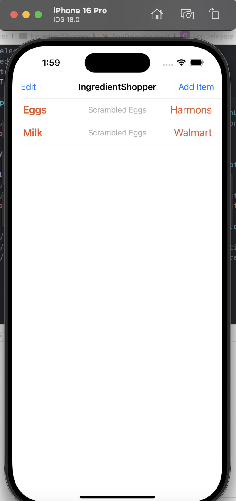
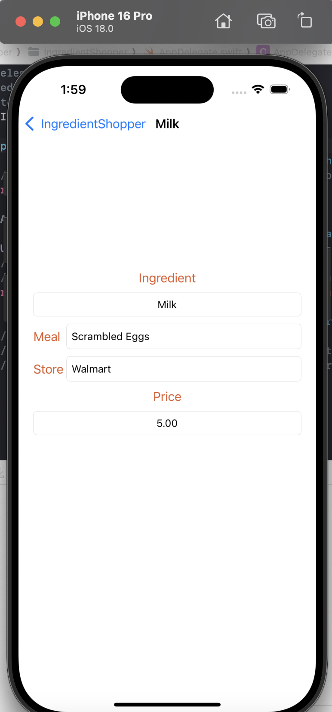

# IngredientShopper

This is a project app I developed for my SE-3020 Mobile Application Development for iOS.  It uses a UITableViewController with a UITableView to show a list of ingredients a user has added to track what ingredients they want to shop for meals.  Each ingredient is shown in an individual UITableViewCell.  Tapping on a cell leads to a second screen with a UIStackView using a UINavigationController.

